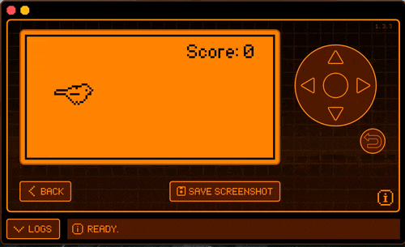

# Flippy Bird

This app is a port of [xMasterX's FlappyBird](https://github.com/xMasterX/all-the-plugins/tree/dev/base_pack/flappy_bird) code to use View's and to implement [CodeAllNight's skeleton](https://github.com/jamisonderek/flipper-zero-tutorials/tree/main/ui/skeleton_app) app UI framework.

There are minor asset swaps and more features to come!

This was all created to learn a bit of C, and flipper plugin develeopment, I hope it helps you in some way too. :)

## Building:

- Install [uFBT - micro Flipper Build Tool](https://github.com/flipperdevices/flipperzero-ufbt)
- Run build tool's update command to fetch the latest dev SDK. `ufbt update --channel=dev`
- `git clone https://github.com/0xForest/FlippyBird`
- Change your terminal's working directory to the FlippyBird project folder: `cd FlippyBird`
- Run `ufbt` to build app or `ufbt launch` to build and launch the app on a connected flipper.
- Built binary will be created as `/FlipperBird/dist/flippy_bird.fap`

## Installing:
- Copy `/FlipperBird/dist/flippy_bird.fap` to your Flipper's SD Card.
- Run by selecting plugin from Games menu.

## Troubleshooting:
- If anything goes wrong, the flipper can be reset by holding the `left arrow` and `back` keys together. 

## Credits:

[DroomOne]: (https://github.com/DroomOne/Flipper-Plugin-Tutorial) For the Flipper plugin tutorial and OG flappy code.

[xMasterx]: (https://github.com/xMasterX/all-the-plugins/tree/dev/base_pack/flappy_bird) For the newer flappy code that builds on newer firmware.

[Codeallnight]: (https://github.com/jamisonderek/flipper-zero-tutorials/tree/main/ui/skeleton_app) Skeleton UI app and all the teachings to make this work.

You! : For exploring the internet and landing here. :)
